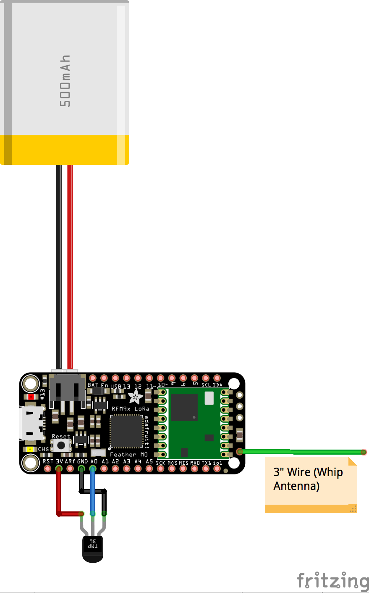

## LoRa Remote Sensor Project

###Purpose

This demonstration project enables remote data collection (temperature) using the Adafruit built [Adafruit Feather M0 with RFM95 LoRa Radio](https://www.adafruit.com/products/3178), TMP36 Analog Temperature Sensor, and the [RadioHead Packet Radio Library](http://www.airspayce.com/mikem/arduino/RadioHead/index.html).

###Parts List

*	[Adafruit Feather M0 with RFM95 LoRa Radio](https://www.adafruit.com/products/3178)
*	[TMP36 Analog Temperature Sensor](https://www.adafruit.com/products/165)
*	[3.7v 500mAhLithium Ion Polymer Battery](https://www.adafruit.com/products/1578)

###Deployment

//TODO

#####SPECIAL NOTICE

Note that this radio breakout is designed to send on frequencies that are open for use in the US without a license. It is possible, however, to configure the radio to operate in the US Amateur bands. If you are not a licensed US radio amateur operator do not alter the frequency. Also, if you wish to operate outside of the US Adafruit offers radios that transmit on alternate frequencies. See product site for more details.

###Hardware

